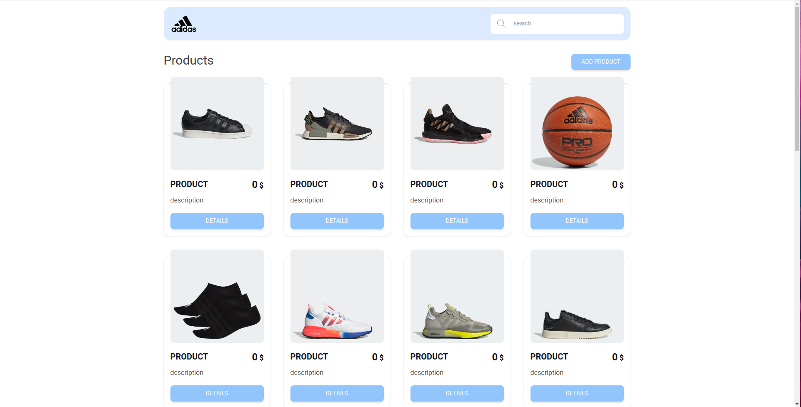
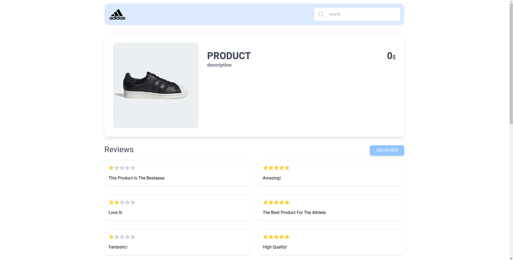
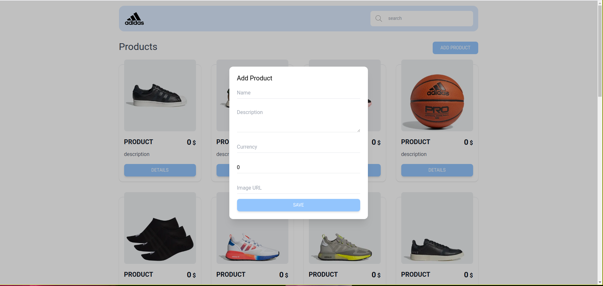
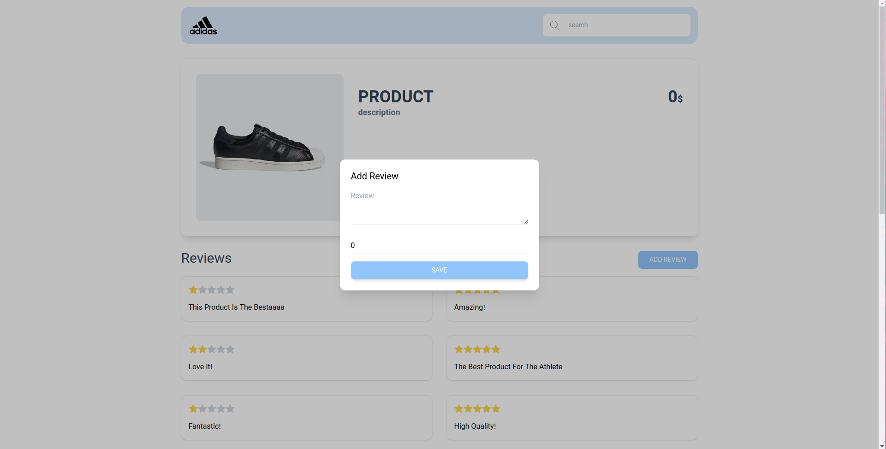
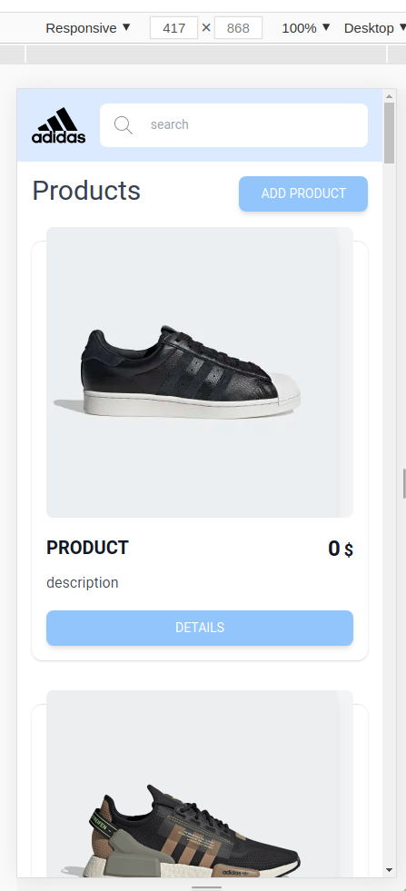
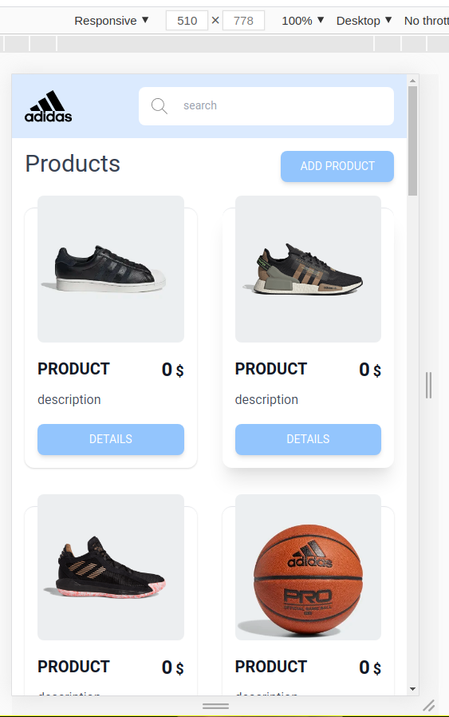
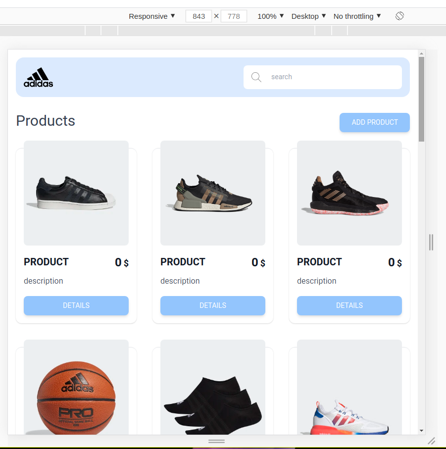
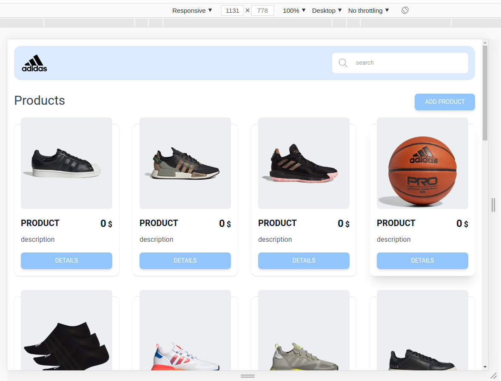
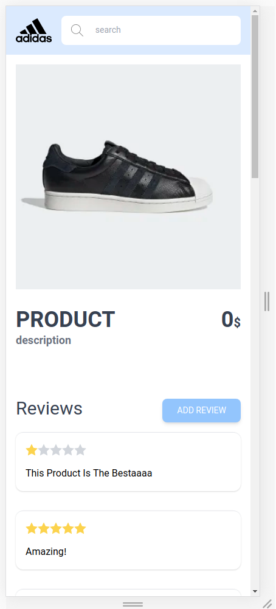
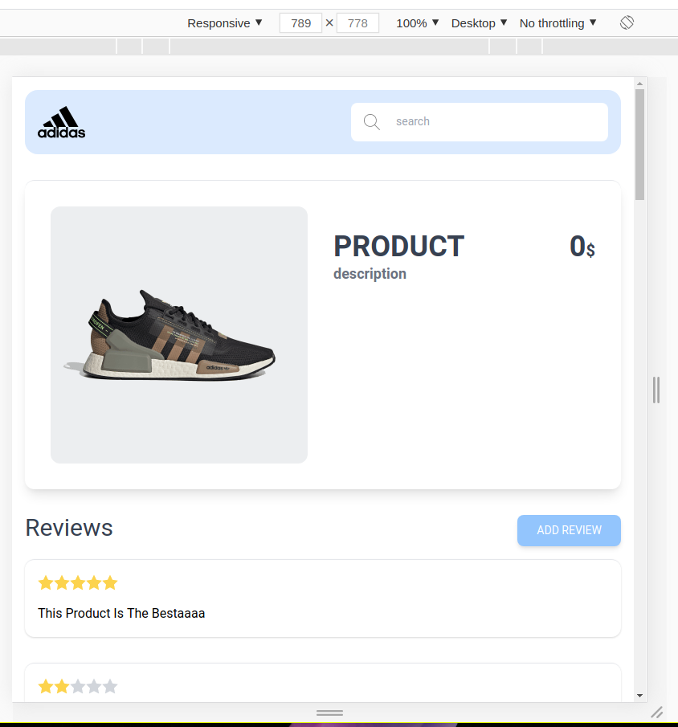

# This is a Sample Project for Showing Adidas Products

This project is using Create React App.

## Pre Configurations

Add a `.env` file in the root of the project with backend API link, something like this:

```
REACT_APP_DEFAULT_URL="http://localhost:3001/"
REACT_APP_REVIEW_URL="http://localhost:3002/"
ESLINT_NO_DEV_ERRORS=true
PORT=3003
```

Also for some reason the backend API that I was using was not allowing CORS requests.
So you need to run chrome or chromium using this command to disable security modules:

`chromium --disable-web-security --user-data-dir=/home/${user}/chrome-user-dir/`

## Available Scripts

### `yarn start`

Runs the app in development mode on the specified port `http://localhost:${PORT}`

### `yarn build`

Build the app in `build` directory

### `yarn lint`

Runs eslint to check for errors

## Dependencies

This project uses `typescript`, `tailwindcss` and `axios`

## Screenshots

This project consists of two pages and a custom router, it is developed to work best on mobile devices too.

Here are some screenshots:











